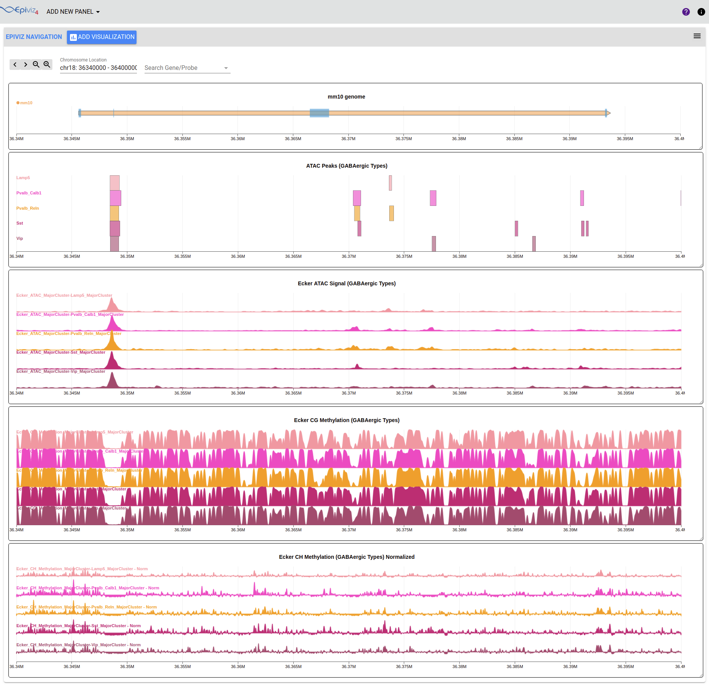

### Epiviz Miniatlas Mouse MOp Workspace

This repository interactively visualizes epigenetic data hosted on NEMO Archive(trackhub configurations) using [Epiviz](http://epiviz.org). Currently this sets up the Miniatlas workspace. 

The script uses caddy to run the webserver but can be replaced with a Python http server or a local PHP server.

##### Requirements  

- Python, using a virtualenv is recommended.
- Bower, Install bower from <http://bower.io/>
- Caddy, Install caddy from <http://caddyserver.com/>

##### Installation 

```
bash install.sh
```

The bash script `install.sh` will install the necessary dependencies to run the file server and the user interface.

##### Run the Workspace

```
bash epiviz.sh
```

The bash script `epiviz.sh` runs the file server and the user interface. 

Open browser and go to <http://localhost:2015/landingpage.html> or <http://localhost:2015/cellgroup.html>

Caddy usually runs on port 2015, but check the terminal prompt for the port number and update this in the link above.

The repository uses the following packages - 

- Epiviz File Server - [GitHub](https://github.com/epiviz/epivizFileParser/), [Docs](https://epivizfileparser.readthedocs.io/en/latest/)
- Epiviz Web Components - [GitHub](https://github.com/epiviz/epiviz-chart), [Docs](https://epiviz.github.io/epiviz-chart/)

##### Screenshot

